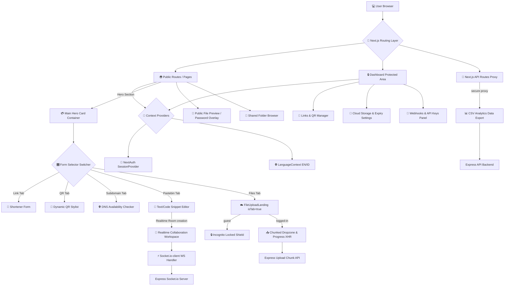

# Nyoo.me Frontend Application 🎨

Sisi Frontend dari platform **nyoo.me** dibangun menggunakan teknologi **Next.js (App Router)**, **React.js**, **Tailwind CSS**, **Framer Motion** (untuk mikro-animasi premium), **NextAuth.js** (manajemen sesi pengguna), dan **Socket.io-client** (sinkronisasi realtime). Aplikasi didesain dengan konsep *all-in-one productivity suite* yang super responsif, berkinerja tinggi, ramah SEO, serta memiliki visual *premium dark-mode* dengan ornamen *glassmorphism* modern.

---

## 🏛️ Frontend Application Flowchart

Diagram berikut memetakan bagaimana layer routing Next.js, Context Providers, manajemen state, API route proxies, dan koneksi socket realtime saling terhubung dengan sistem:



---

## 💎 Premium Design Aesthetics & UX

Nyoo.me mengadopsi standar desain premium terkini untuk menghadirkan pengalaman pengguna yang luar biasa:

1. **Curated Color Harmony:** Menghindari warna bawaan mentah (raw HTML colors). Menggunakan palet gradasi terkurasi tinggi, memadukan **Violet-600**, **Indigo-500**, dan **Fuchsia-500** dengan latar belakang gelap pekat **Slate-950** dan **Indigo-950** untuk menciptakan kesan futuristik yang bercahaya.
2. **Glassmorphism Backdrop:** Menerapkan efek kaca semi-transparan (`bg-white/70 backdrop-blur-2xl border-white/80 dark:bg-slate-950/60 dark:border-slate-800/70`) pada kartu formulir utama untuk memberikan efek kedalaman yang elegan.
3. **Advanced Typography:** Mengintegrasikan font modern premium **Inter** dan **Outfit** yang dimuat secara dinamis, menggantikan font bawaan browser.
4. **Framer Motion Micro-Animations:**
   - Transisi pemilih tab yang meluncur mulus menggunakan `layoutId="tabBg"` dari Framer Motion.
   - Efek hover interaktif, loading spinner, serta gembok akses terproteksi yang memantul secara natural.

---

## 🧠 Core Features & Architecture

### 1. Unified Form Selector Tabs (Hero Section)
Alih-alih menumpuk berbagai fitur secara vertikal yang mengacaukan tata letak halaman, Nyoo.me menyatukan seluruh fitur utama ke dalam satu kartu pemilih terpadu (tab switcher):
- **Short Link:** Formulir pemendek tautan yang responsif dan fleksibel.
- **QR Code:** Engine pembuat QR Code yang dinamis dan terintegrasi langsung dengan pilihan templat visual kustom.
- **Subdomain:** Mesin pencari ketersediaan nama subdomain CNAME yang unik bagi pemilik bisnis.
- **Pastebin:** Pembuat catatan terenkripsi, sekali baca langsung hangus, atau ruang kolaborasi realtime bersama rekan kerja.
- **Files (Nested Tab Uploader):**
  - Mengintegrasikan komponen `<FileUploadLanding isTab={true} />` langsung ke dalam Hero Card utama.
  - Opsi `isTab={true}` memberitahu komponen untuk secara otomatis mematikan pembungkus luar dan judul di bagian atas, sehingga dropzone file melebur 100% dengan gaya estetik form switcher.

### 2. Public File & Folder Portals
- **Password Protection Screen:** Overlay form masukan sandi yang dinamis. Jika berkas dilindungi sandi, browser akan memblokir akses dan memunculkan prompt sandi sebelum berinteraksi dengan API unduhan aman.
- **Shared Folder Browser:** Eksplorer direktori premium yang mendukung pengunduhan massal item di dalamnya dengan tetap mematuhi izin enkripsi sandi folder.
- **Tampilan Kadaluwarsa (Expired Page):** Menyajikan ilustrasi visual jam pasir premium yang elegan bertema *"Tautan Telah Kedaluwarsa"* ketika mendeteksi berkas/link yang sudah lewat tanggal aktifnya.

### 3. Analytics & Export (Secure Proxies)
- **Next.js API route handler** bertindak sebagai perantara yang aman (secure proxy) untuk mengautentikasi dan mengunduh data analitik klik tautan berbentuk file **CSV** langsung dari Express API ke komputer lokal pengguna.

---

## 🛠️ Getting Started & Build

### 1. Konfigurasi Environment (`.env`)
Salin file `.env` di dalam folder `next-shorturl` dan isi konfigurasi berikut:
```env
# URL utama backend API Express
NEXT_PUBLIC_API_URL="http://localhost:1888"

# Konfigurasi NextAuth (JWT secret & URL)
NEXTAUTH_SECRET="any-random-super-secure-hash-key"
NEXTAUTH_URL="http://localhost:3000"

# Cloudflare Turnstile Site Key
NEXT_PUBLIC_TURNSTILE_SITE_KEY="your-turnstile-site-key"
```

### 2. Install Dependensi
```bash
npm install
```

### 3. Jalankan Aplikasi
```bash
# Mode Development (dengan hot-reload)
npm run dev

# Mode Production Build & Run
npm run build
npm run start
```
